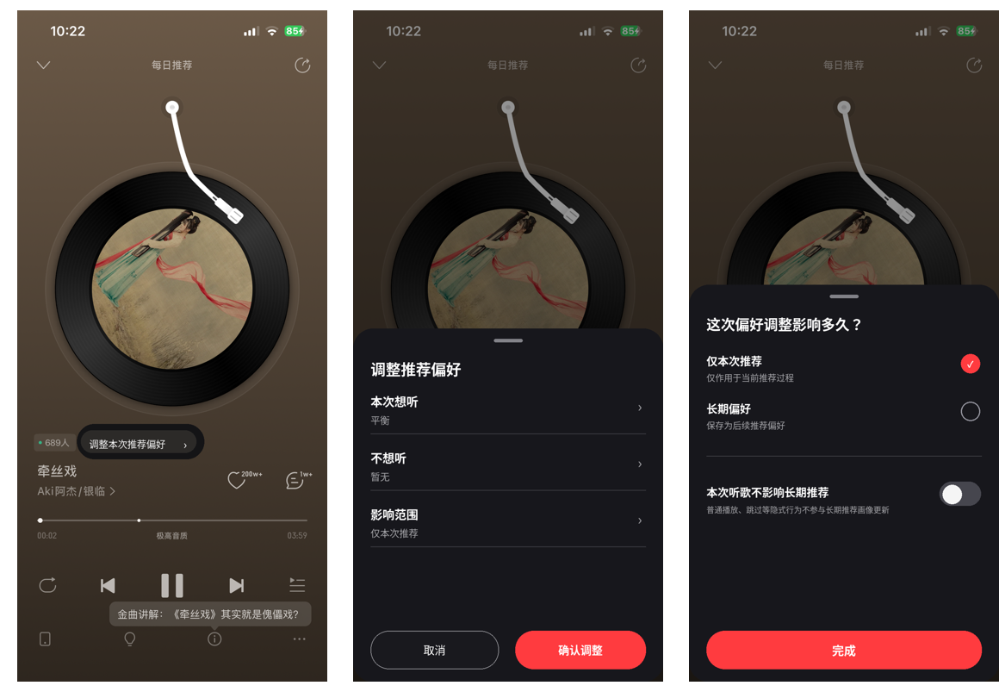

# HTML制作规格

版本：v0.5.1 / 2026-09-05 / 已批准进入 Batch 2 本地 Beta；不代表已上线。

## 01｜HTML 产品形态与验收边界

网易云音乐推荐控制｜HTML 制作规格 v0.5.1
面向求职公开作品集 · 与 PRD v0.5.1 配套 · 当前不含应用代码

公开网站先讲清问题，再让招聘者体验三条短流程。主站不是重做网易云，也不是一屏堆满JSON的技术后台。核心演示依赖本地虚构数据；R07是可关闭的附加实验。

| 区域 | 内容与用户动作 | 明确不做 |
| --- | --- | --- |
| 案例页 / | 项目问题、证据边界、三项产品决策与关键取舍、体验入口、方法与反思、文档链接。 | 不写没有数据支撑的增长大数字、虚构采访或官方合作身份。 |
| 交互页 /demo | 推荐列表、播放页、统一弹层、少推、临时状态、撤销；选择 Demo 1/2/3 任务。 | 不实现完整网易首页、评论、登录、会员和曲库服务。 |
| R07实验面板 | 在交互页内折叠入口；规则模拟输入、可编辑候选、失败/回退。 | 不默认打开全屏聊天，不自动请求模型。 |
| 产品说明抽屉 | 当前作用范围、状态、演示事件、排序原因；默认关闭。 | 不给普通用户暴露所有工程字段；不把调试工具冒充产品功能。 |

### 全站常驻声明

“个人产品概念，非网易官方项目。歌曲与推荐数据为演示数据；当前未调用真实模型，不连接真实音乐账号。”核心功能区不使用“算法已更懂你”“保护了真实画像”等文案。

### 技术形态建议

React + TypeScript + Vite；普通CSS与设计Token；状态由明确的reducer/状态机维护，排序与UI解耦。Vitest验逻辑，Playwright验流程与截图。无真实API、无后端部署、无自动播放音频；版本由B2创建工程时锁定，本文不写未经核验的依赖版本。

优先使用客户端hash路由或与托管路径兼容的轻路由，保证直接打开/刷新演示页可用。文件双击运行并非承诺：默认通过本地开发服务器或静态托管访问。发布、域名和外部模型费用需单独明确授权。

## 02｜页面规格与可见任务

| 页面 / 状态 ID | 信息与主动作 | 必要状态 |
| --- | --- | --- |
| P01 案例页 | 主标题“推荐可以懂你，也应该听你调整”；副标题解释本次/长期；按钮“体验推荐调整”“阅读项目说明”。 | 桌面横向叙事＋演示预览；手机先说明后体验；无空统计卡。 |
| P02 推荐页 | 有限歌曲列表、调整推荐入口、常驻状态、当前播放条。 | 初始、重排成功、刷新失败、候选不足；标题明确“演示推荐”。 |
| P03 播放页 | 保留唱片中心的识别结构；虚构封面与歌曲名；播放模拟控件、调整推荐、更多。 | 播放/暂停均标“模拟”；切歌与打开面板时目标快照一致。 |
| P04 调整总面板 | 想听、不想听、影响范围三行；状态摘要；次级“已保存偏好”；取消/确认；需要时显示保存当前差异的确认项。 | 未改、已改、提交中、提交失败；无变更确认禁用。 |
| P05 本次想听 | 新鲜程度分段单选＋五类标签切换；最多3项；完成/返回。 | 默认/选择/达到上限/冲突；内容标签区可滚动。 |
| P06 不想听 / 快捷少推 | 对象名、歌曲/音乐人/风格单选；说明仍可能出现；黑名单只读说明。 | 选中、未知风格不可选、独立快捷提交、冲突提示。 |
| P07 影响范围 | 仅本次/长期Radio；独立临时收听Toggle；两个维度的短说明。 | 四种组合全部可解释；未确认不生效。 |
| P08 长期管理 | 本项目已保存标签与少推项；移除、清空、确认、返回。 | 空状态/已有项/清除确认；与脏草稿进入规则一致。 |
| P09 状态与撤销 | 当前调整摘要、临时收听中/待确认、撤销上次、结束本次。 | 关闭保护不会清空长期偏好；撤销冲突有解释。 |
| P10 R07 候选 | 输入、模拟标识、解析/澄清/失败、候选差异、采用或手动调整。 | idle/parsing/ready/needs_clarification/unsupported/error；不显示假置信度。 |

> 不要把10个页面ID都做成独立网页。P04–P08/P10是弹层或子视图；P09是跨页面的状态组件。首屏只展示需要的动作，工程信息默认折叠。

## 03｜三条主流程与页面文案

| 流程 | 默认演示任务 | 通过条件 |
| --- | --- | --- |
| Demo 1 主动调整 | P03 → P04 → P05：探索＋民谣 → 完成 → 仅本次 → 确认 → 后续推荐变化 → 撤销。 | 不预选民谣；当前歌不被打断；生效范围有提示；撤销回到先前设置而非重播。 |
| Demo 2 即时少推 | P03更多 → P06：少推当前音乐人 → 确认 → 结果/分数变化 → 撤销。 | 无需走完整设置；目标不随播放切歌变化；少推不被说成永久屏蔽。 |
| Demo 3 临时收听 | P04 → P07开启临时 → 确认 → 切推荐/搜索来源/歌单来源 → 观察状态 → 推进时间 → 继续/关闭。 | 隐式事件隔离；明确收藏仍保留；待确认仍保护；关闭不回填历史。 |
| 附加 AI 流程 | P10输入 → 看候选与未识别条件 → 采用 → P04检查 → 确认。 | 输入不能直接改变推荐或长期范围；失败不改变当前状态。 |

### 固定文案字典

| 场景 | 对用户说什么 |
| --- | --- |
| 仅本次解释 | “只保存这轮调整；普通听歌仍可能影响长期推荐。需要保护时，开启下方临时收听。” |
| 临时收听解释 | “开启后，本设备的普通播放、时长和跳过不用于长期推荐。收藏等主动操作仍会保留。” |
| 长期＋保护 | “本轮明确选择会长期保存；普通收听仍受到保护。” |
| 少推提示 | “会减少这类内容的出现机会，但仍可能遇到。” |
| 已保存但刷新失败 | “设置已保存，推荐尚未刷新。”操作：“重试刷新”“继续听歌”。 |
| 保护到时 | “已到提醒时间，当前仍不用于长期推荐。”操作：“继续4小时”“关闭临时收听”。 |
| 不支持输入 | “这部分还不能直接处理，请确认或改用手动选择。”并显示具体未识别片段。 |
| 撤销成功 / 冲突 | “已撤销本轮调整。” / “设置已有新的修改，请查看当前状态后调整。” |

错误文案解释发生了什么、现在保存了什么、用户可做什么；不只显示“失败，请重试”。示例输入和真实输入明确分开；输入框不预填一个看起来像用户已说过的话。

## 04｜视觉基线与具体取舍

原型视觉基线来自v0.4内嵌的真实播放页与新增暗色弹层；不是重新设计播放器。下面三图为旧版参考，不能视为v0.5新页面或已完成HTML。



### 保留与修正

保留：唱片居中、播放区结构、暗色弹层、红色主操作、三行汇总。修正：文字可读性、长期/临时区别、返回与关闭、顶部/迷你播放器保护状态，以及额外确认的可达性。公开Demo封面与曲名换成虚构素材，不直接使用真实专辑图作为生产资产。

案例外壳采用中性白底与黑灰文字；红色只用于关键动作和当前控制。桌面以“说明＋可交互设备视图”形成重点，手机不套双重手机框。避免通用AI蓝紫渐变、玻璃卡片、炫光、满屏药丸和无意义进场动画。

> 视觉规格约束比“高级、简洁、现代”更具体。Codex不得因公开frontend-design skill鼓励探索而改变已给定的播放器识别结构；本项目的设计边界优先。

## 05｜视觉Token、布局与适配

| 维度 | 固定规格（D/M） | 验收方式 |
| --- | --- | --- |
| 颜色 | caseBg #FAFAFC；surface #FFFFFF；text #17171B；muted #61616B；darkBg #131317；sheet #1B1B20；primary #D92D3A。 | 正式主按钮白字用深红而非沿用过亮红；测普通文字4.5:1、UI关键边界3:1。[W10] |
| 字体 | 中文：系统无衬线，PingFang SC / Microsoft YaHei / Noto Sans CJK SC；数字/JSON仅在说明区用等宽。 | 不打包系统字体；不要求用户额外安装字体；不为“个性”降低中文阅读性。 |
| 字号 / 行高 | 案例标题48/58桌面、32/42手机；正文16/26；组件标题20/28；按钮16/24；辅助14/20；说明区最小12。 | 200%缩放不裁字；正文不能用12px来塞内容。 |
| 间距 / 圆角 | 间距4/8/12/16/24/32/48/64；弹层水平22（窄屏16）；弹层上角24；按钮12；标签16。 | 相邻同类组件对齐，不随意混用18、23、27等间距。 |
| 触控 / 按钮 | 主按钮高48，所有关键点击区至少44×44；Radio视觉24但整行可点；Switch48×28但外层触控48。 | 44为本项目更严格目标，不误称WCAG2.2 AA普遍要求44；AA最低24另有例外。[W10] |
| 弹层 | 参考390×844；内容高自动，max-height=视口90%；底部动作固定在弹层内、主体滚动。遮罩42%。 | 不得把旧稿的y=400写成所有屏幕的固定起点；软键盘出现仍能看到输入与确认。 |
| 桌面 / 平板 / 手机 | ≥1100：最大内容1120，说明与演示双区；768–1099：上下排列；<768：单列全宽，保留16边距。 | 320、390、768、1440宽都无横向溢出；手机不整体缩放390稿。 |
| 层级 / 动效 | 内容0，顶部导航10，遮罩40，弹层50，状态反馈60；过渡180/240ms。 | 无障碍焦点明显；prefers-reduced-motion下关闭位移动画，不让动画改变结果。 |

界面视觉“重点”是用户调整前后的状态变化，不是营销插画。推荐列表可用虚构专辑色块和几何封面；只在预览中强调被影响的行，不用大面积随机换色伪造推荐进化。完整Token见specs/design-tokens.json。

## 06｜状态、数据与本地保存

| 状态对象 | 包含内容 | 不得混入 |
| --- | --- | --- |
| demoCatalog | 虚构歌曲ID、音乐人ID、标签、时长、baseScore、novelty、playable；预置黑名单。 | 真实账号数据、版权音频与真实用户画像。 |
| persistentPreference | 本演示保存的长期字段、少推对象与版本。 | 平台原始模型权重；当前会话草稿。 |
| sessionOverride | 当前会话修改的字段、开始/最近听歌时间、作用来源。 | 普通播放自动生成的长期写入。 |
| temporaryState | off / active / review_required；开始、提醒、事件保护标记。 | review_required不等于off；不能在超时时隐式恢复学习。 |
| draft | 打开时基线、dirtyFields、当前歌曲快照、draftRevision、候选预览。 | 提交成功前不写生效状态；AI解析不直接改persistentPreference。 |
| operation / undo | operationId、before/after patch、base/applied revision、结果状态。 | 不回滚独立的喜欢/播放进度；不覆盖后续相关变更。 |
| eventBuffer | 本地模拟事件，含环境标识、时间、版本与来源。 | 不含自由输入、真实标识、真实收听记录。 |
| AI request | requestId、draftRevision、当前白名单上下文、输入内存值。 | 无历史敏感数据；取消/过时request结果不写草稿。 |

### 刷新与重置

本演示状态只在同一标签页的sessionStorage保存；输入原文不保存。刷新先校验schemaVersion和时间戳，过期会话按规则恢复；存储不可用则退到内存模式并提示“刷新后将重置”。不模拟跨设备同步。

“重置演示”清除本项目命名空间内的状态与事件，恢复虚构种子；不清除浏览器其他应用数据。关闭页面时不依赖unload做关键写入。说明抽屉展示当前会话范围与是否保护，而不是说“已改变你的网易云画像”。

### 事件与播放模拟

不自动播放声音。控件改变虚构播放器状态；“推进播放/时间”只在测试工具中出现。所有计算值都标为演示，不根据招聘者停留网页时长推断音乐偏好或记录真实播放。排行榜变化来自固定公式，不能用随机数模拟AI懂你。

## 07｜AI契约与适配器接口

本轮交付intent.schema.json、intent-request.schema.json、AI_CONTRACT.md与40条合成用例；不交付真正的解析器或模型调用实现。

```text
{
  "status": "ready",
  "patch": {
    "freshness": "familiar",
    "positiveTagIds": ["lang_zh", "mood_calm"],
    "negativeTargets": null
  },
  "scopeSuggestion": null,
  "isolationSuggestion": null,
  "unmappedPhrases": [],
  "clarificationQuestion": null
}
```

| 检查层 | 通过条件 / 失败行为 |
| --- | --- |
| 输入边界 | 200字、纯文本、白名单上下文；HTML或指令片段作为数据处理，不执行、不过度渲染。 |
| 结构边界 | required完整、additionalProperties=false、枚举与数组上限通过；空数组和null语义不同。 |
| 内容/对象边界 | 标签ID在字典中；音乐人/歌曲来自给定上下文或虚构曲库；同标签正负冲突不执行。 |
| 语义边界 | 否定、范围、时间要求、未知标签与清空意图需单独测试；结构合法不意味着理解正确。 |
| 权限边界 | R07只提出候选，不能调用推荐执行、长期画像、删除、拉黑或账户操作。范围/保护建议必须手动确认。 |
| 异步与失败 | 取消或revision已变时丢弃结果；本地解析无外部API。未来模型模式：有界超时、最多一次受限重试、返回手动。 |
| 日志与评估 | 记录匿名样例编号、版本、结构结果和错误类别；开发用例结果≠真实用户效果。默认不存用户输入。 |

未来接入真实模型前必须另行核验：模型和接口支持、数据处理与地区条件、输入/输出限额、单次/总成本、速率限制、超时和服务端密钥。浏览器前端永远不接收提供方密钥。当前不因为存在免费层就依赖其永久可用。

## 08｜无障碍、故障与公开质量

模态交互按W3C Dialog Pattern：进入弹层时将焦点移入；Tab限制在弹层内；Esc按层返回；关闭后回到打开按钮；背景不可交互。[W10] 采用原生dialog或等价实现，避免一个视觉遮罩下面仍能点到播放按钮。

| 类别 | 必须覆盖的检查 |
| --- | --- |
| 键盘 / 读屏 | 按钮有可理解名称；Radio/Toggle有原生语义和分组说明；可见焦点；状态反馈用polite区域，不反复打断。 |
| 尺寸 / 阅读 | 320px宽、横屏、200%文字缩放、中文长标签、系统大字；内容可滚动但主操作不被遮住。 |
| 触摸 / 手势 | 所有功能可用可见按钮；滑动不作为唯一出口；拖动/左右滑不冲突系统返回或播放器。 |
| 对比 / 色觉 | 不是仅红色表示选中，增加勾选/边框/文字；普通文字至少4.5:1。完整Token核算不替代实际页面测量。 |
| 无网络 / 错误 | 本地曲库、组件和图标随构建提供；核心流程无外网依赖；错误分“保存失败/刷新失败/解析失败”。 |
| 性能 / 动效 | 优先小型静态资产，无第三方视频；首屏不等待远程字体；无必要循环动画；减少动画设置可用。 |
| 公开内容 | 不展示API密钥、真实用户姓名、未经允许的测试录像、原始调查数据；版权素材有来源和授权记录。 |
| 运行指标 | B2建立固定设备/浏览器/网络测量记录；无数据不写Lighthouse满分或“已达到WCAG合规”。 |
| 日志 / 清除 | 说明抽屉能看到模拟事件，并能重置本地数据；不把模拟埋点上报给真实分析平台。 |

### 禁止的伪完成

不放点不动的收藏/分享/黑名单管理入口：要么实现说明中的有限动作，要么移除/显式禁用并解释。不能把接口失败写成成功Toast。不能只做录屏路径，其他返回和错误路径却空白。

公开素材阶段再制作虚构几何封面；旧版网易截图只用于内部设计校准与有来源的案例对照，不默认变成可再发布资产。是否公开展示对比截图须在发布审查中确认，个人概念声明不自动等于获得素材授权。

## 09｜Codex执行方式与视觉自审

将B2作为一次完整实现批次：先读规格与项目skill，再建工程、实现核心和异常、运行测试与截图、集中修复、一次回交。不得每改一句文案要求用户审批，也不得自己改产品范围。

| 环节 | Codex应做什么 | 本助手审查什么 |
| --- | --- | --- |
| 开工读包 | 读AGENTS、PRD、HTML规格、DECISIONS、契约、验收与两份SKILL；复述尚未执行内容。 | 是否把R05/R06误做主功能，是否把规则模拟冒充真实AI。 |
| 建立组件 | 先实现按钮、Radio、Toggle、标签、弹层、Toast、状态条；全部使用Token。 | 对齐、字体、间距、层级；不要先写十个独立页面再统一样式。 |
| 逻辑与流程 | 先R03/R04及取消/撤销/过期/错误，再可选R07；排序可重复。 | 状态与权限正确；字段/参数不与PRD漂移。 |
| 自动化回归 | Vitest校验状态和排序；Playwright覆盖 Demo 1/2/3、AI 实验及边界。 | 报告测试数量、命令、失败和未测项，不能只说全部正常。 |
| 截图与视觉修复 | 固定seed与状态，320×740、390×844、768×1024、1440×900；至少8个关键状态。 | 逐图看裁切、重叠、灰底、可见焦点、密度与小屏长文本。 |
| 集中handback | 提交变更文件、运行方式、测试报告、截图路径、剩余风险、来源与授权清单。 | 本地与仓库版本、文档一致性；整理用户真正需要看的少数决策。 |

### 视觉放行不是“npm build成功”

严重阻断：内容重叠或裁切、主操作被挡、返回不可达、状态无法辨认、白字红底对比不足、移动端整体缩小导致触控过小。发现任意一项不交付。

设计复核：每屏只突出一个主要动作；页面标题/按钮/Toast用同一动词；弹层内留白来自间距体系；大量空白不靠缩小正文解决。截图与参考需并排检查，列出有理由的差异，不追求复制旧版错误。

> 已附项目自定义skill：netease-product-review、netease-visual-qa；它们是本轮新编写的审查指令，不是第三方插件已安装的证明。Anthropic公开skill作为方法参考，不整段复制进交付包。

## 10｜交付清单、下一批门槛与协作

### B2完整输出

可运行源代码与锁文件；本地运行和静态部署说明；PRD/HTML规格同步改动记录；自动化测试结果；关键状态截图；素材清单；已知限制与产品演示讲稿。构建文件不是唯一成果，测试与截图也必须回交。

| 决策边界 | 处理方式 |
| --- | --- |
| 可以自行完成 | 组件实现、命名、布局细化、无功能影响的视觉修复、测试补齐、文案排版。 |
| 必须返回产品决策 | 会话/保护含义、长期写入权限、少推与屏蔽关系、真实数据处理、R05/R06范围、AI执行权。 |
| 需要用户明确授权 | 公开部署、付费服务、真实模型请求、真实问卷/用户材料公开、创建或覆盖用户已有项目文件。 |
| 整批审查而非逐句确认 | 每批先自检并集中修复；只汇总严重问题、产品取舍和需要补的事实。 |
| 默认开发输入 | 本交付包是已批准的本地 Beta 规格快照；尚未生成应用代码或创建远程仓库。旧 PRD 不覆盖新规则。 |
| 稳定后再更新 | 当前可直接将 v1.1 包放入独立目录，并执行根目录 `BATCH2_CODEX_MASTER_PROMPT.md`；实现、测试、截图和自审完成后集中回交。 |

### 本轮完成与未完成

完成：PRD、HTML页面/状态/视觉规格、来源审查、产品决策、AI契约和合成用例、验收场景、Token与项目skill。未完成：HTML工程、真实解析器、运行时测试、全量Figma链接QA、真人测试、真实模型评估和公开上线。

### 用户集中审查的四个点

一是用户分类是否贴合真实经历；二是“仅本次不等于停止长期学习”是否清楚；三是到时仍保护的提醒是否合理；四是首版只做R03/R04、R07独立实验而不扩展R05/R06的范围是否接受。其他实现细节由后续整批开发与自审处理。

真实问卷可以晚些补；近期实机录屏和W3原文件可以增加证据，但不阻断本地模拟开发。首版完成后再以真实用户任务测试检验可发现性、理解与操作成本。

> 项目负责人已批准启动 Batch 2 本地 Beta。当前仍未生成应用代码，也未创建/修改远端 GitHub 仓库、写入 Figma 或请求任何真实音乐/模型 API；这些边界继续有效。


## 11｜方案取舍在作品集中的呈现

页面必须让招聘者看到“选择不是凭感觉”，但不能把案例页做成内部评审数据库。数据源为 `specs/portfolio-decisions.json`，详细解释为 `docs/TRADEOFFS_AND_REJECTED_ALTERNATIVES.md`。

### 11.1 快速层：3 张关键决策卡

默认展示 T02 入口形态、T04 控制模型、T07 AI 实现。每张卡包含：

1. 决策问题；
2. `采用 B` 的一句话；
3. 选择标准 3–4 项；
4. 一个最重要的代价；
5. 可展开的“为什么没有选 A/C”。

首屏不展示完整评分矩阵，不使用虚构的精确分数。卡片的主标签是“采用 / 未采用 / 延后”，不得使用“赢了 / 输了”或把延后写成无价值。

### 11.2 深读层：完整 Alternatives considered

在“证据 → 决策”之后增加 `方案取舍` 章节，展示 T01–T08。桌面可使用横向方案列，手机改为纵向折叠：先显示采用方案、理由和代价，再展开其他方案。每项必须有“反转条件 / 怎样验证”，避免只为最终答案找理由。

建议组件结构：

```text
DecisionSection
  ├ DecisionCard (quick)
  └ DecisionComparison (deep)
       ├ DecisionOption A / B / C
       ├ CriteriaChips
       ├ Tradeoff
       └ ValidationOrReversal
```

### 11.3 用词与实验区分

- 产品方向比较：写“方案 A/B/C”或“候选方案”。
- 演示任务：写 `Demo 1/2/3`，不用 Flow A/B/C，避免与方案比较和随机实验混淆。
- 随机因果验证：写“A/B 对照实验”。
- 页面不得出现“我们通过 A/B 测试选择了 B”，因为目前只有设计取舍，没有真实线上实验。
- `为什么选 B` 的文案应包含 B 的代价；不能只列优点。

### 11.4 对外展示内容

可公开：独立控制中心为何未选、手势为何延后、两个控制为何拆开、真实 LLM 为何不在首版、自动静默关闭为何未采用。

默认不放首屏：详细算法参数、全部异常状态、每条研发依赖；这些进入深读或 Product Notes。

简历只保留一句结果导向表述，完整取舍用于面试。HTML Beta 完成前，不写“已构建并上线”；完成本地 Beta 后也只能写“构建可交互 Demo”，除非另行公开部署。

### 11.5 验收

- 快速层 90 秒内可以说出至少 2 个被比较的方案与最终选择；
- 每个决策都有代价，不存在只有“为什么 B 好”的宣传文案；
- `延后` 与 `未采用` 视觉和文案不同；
- 320px 宽时三方案不被压成不可读表格；
- Decision 数据来自单一 JSON，不在组件复制第二份；
- 页面明确区分方案比较和真实 A/B 实验。

### 11.6 方案取舍专项验收

- AC31：90 秒快速层显示 T02/T04/T07，且均从 `specs/portfolio-decisions.json` 读取。
- AC32：深读层覆盖 T01–T08，并清楚区分采用、未采用与延后。
- AC33：页面将设计阶段的“方案 A/B/C”与上线随机分流的“A/B 对照实验”分开，不宣称已通过线上实验选出方案 B。
- AC34：320×740、390×844 与 200% 文字缩放下仍可阅读；移动端使用纵向卡片或折叠，不压成三列小字，也不产生横向溢出。
