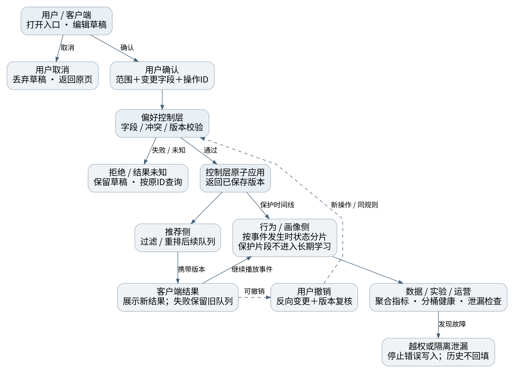

# 网易云音乐推荐控制链路优化 PRD

版本：v0.5.1 / 2026-09-05 / 已批准进入 Batch 2 本地 Beta；不代表已上线。

## 01｜项目定义与交付边界

网易云音乐｜推荐控制链路优化 PRD v0.5.1
作品集评审版 · Batch 1 · 2026-09-05

> 项目性质：独立产品概念与交互验证，不是网易官方项目。当前没有真实问卷原始数据，没有上线实验、真实模型效果或业务增长结果。

核心问题不是再做一个推荐入口，而是让用户在听歌过程中明确表达：想听什么、少听什么，以及这次调整影响多久。原 v0.4 已有统一入口与三条原型流程；本版补齐证据边界、用户差异、执行规则和验证方案。[S01][S02]

| 需求 | 产品优先级 | 本轮定义 / 后续 HTML 范围 |
| --- | --- | --- |
| R03 推荐控制链路 | P0 | 定义并计划实现：想听、少推、影响范围、撤销、已保存偏好管理；复用现有推荐能力的概念边界。 |
| R04 临时收听 | P1 | 定义并计划实现：当前设备的隐式行为隔离、常驻状态、到时提醒和关闭。 |
| R05 历史推荐影响管理 | P2 后续 | 本轮补清排除边界和依赖；不在首版 HTML 中制作完整操作流程。 |
| R06 手势快捷入口 | P2 实验 | 只保留方案与验证条件；首版使用可见按钮，不要求用户记住新手势。 |
| R07 一句话调推荐 | P2 实验 | 定义受限自然语言入口、候选预览与评估集；首版为独立、本地规则模拟，不是已接入真实 AI。 |

### 目标与非目标

用户目标：降低表达和纠偏成本，理解影响范围，能够返回、撤销和恢复。产品目标：验证显式控制是否改善推荐体验，同时不增加理解负担、不缩窄内容过度。业务价值是待验证的推荐留存与信任，不直接承诺收入增长。

非目标：重做网易云推荐模型、音乐版权与账号系统、首页与评论；接入真实账号和播放历史；构建通用 Agent；公开真实音乐流；在本轮编写应用代码或发布网站。

### 阅读与版本规则

本文回答产品做什么、为什么及规则边界。HTML 制作规格回答如何呈现和验收。JSON 规格提供默认参数与数据契约；若与正文冲突，先记录并修正文档，禁止由 Codex 自行选一套规则。当前已获批进入 Batch 2 本地 Beta；这只代表产品与制作规格冻结，不代表应用开发、真实用户验证或上线已完成。

## 02｜证据、问题推导与研究边界

证据分四类：来源事实 F、设计决策 D、待验证假设 H、演示参数 M。以下产品规则除明确引用外均为本项目 D/M，不代表网易内部实现。

| 来源与可信边界 | 支持什么 | 不能支持什么 |
| --- | --- | --- |
| [S01] v0.4，8 页 | 还原原范围、流程与当时实机观察的记录。 | 不能证明 2026-09-05 所有账号和版本仍相同，也不能证明后台如何学习。 |
| [S02] 课堂完整转写 | 明确老师对本作业的点评，重点为 00:59–01:15。 | 其他同学的调研人数、功能编号和效果不属于本项目。 |
| [S03] 课堂总结 | 辅助定位内容；与转写有冲突时，以完整转写及上下文为准。 | 不能把总结中的合并叙述当成逐字事实。 |
| [S04] 早期研究文件检索片段 | 15 题、20 个模拟案例；原问卷包含使用频率与时长选项。 | 没有真实回收数；不据模拟案例计算市场占比、显著性或需求发生率。 |
| [S05] 本轮 Figma 读取 | 已读取播放页和总面板截图接口；直接查看总面板，尺寸 390×844。 | 未逐个复核全部 Frame、跳转与状态，不能称现有 Figma 已通过 v0.5 验收。 |

| 观察 / 假设 | 中间推导 | 决策与验证 |
| --- | --- | --- |
| 原作业记录控制入口分散。[F] | 用户可能难以找到纠偏路径；“找不到”与“调了无效”是两种问题。[H] | R03 聚合入口；分别测发现率、完成率和调整后的体验。 |
| 老师指出精准偏好、探索、新手的诉求不同。[F] | 同样高频不等于想要相同推荐。[H] | 按意图与能力分层，并与频率、时长交叉分析。 |
| 临时收听可能影响长期兴趣。[H] | 场景性行为不一定代表稳定喜好；实际影响仍需事件日志核验。 | R04 提供前置控制；先验事件隔离正确，再测用户理解与后续体验。 |
| 自然语言能一次表达多个条件。[H] | 可能节省逐项选择，也可能增加解析与确认负担。 | R07 独立实验；与手动选择对照，不把“使用 AI”本身当收益。 |

> 替代解释必须保留：推荐不合意可能来自版权/候选池变化、短期兴趣改变、歌曲热点或网络失败，而不是画像被污染。W3 原文件与公开反馈逐条记录本轮未取到，相关结论不作为新增定量证据。

## 03｜用户分层：先定义口径，再讨论高频

回应老师 00:30:05–00:31:21 与 00:59:03–01:00:20 的建议：把“高频”拆成可观察的行为变量，但不把它当成需求类型。[S02] 下表阈值用于招募和后续分析的初始方案，未经过真实数据校准。

| 维度 | 操作定义（D/M） | 使用方式与注意点 |
| --- | --- | --- |
| 使用频率 | 取分析日前 28 个完整自然日。推荐活跃日＝当日从推荐来源实际开始过至少一次播放的日期；高频 ≥16 天，中频 4–15 天，低频 1–3 天，0 天单列。 | 原问卷“每天/每周4–6天/1–3天/更少”问的是 App 使用，不是推荐使用；两者不能互换。 |
| 窗口不足 | 首次使用未满 28 天时，频率标为“观察不足”；保留已观察天数，不直接归为低频。 | 新用户单列；不将短观察期按比例外推为成熟高频用户。 |
| 使用强度 | 全部音乐收听活跃日的平均实际收听分钟数：<30、30–<60、60–<120、≥120。去掉暂停与缓冲；保留连续值。 | 频率是“多少天用”，强度是“用了多久”。沿用原问卷时长维度并明确边界，不声称这些就是平台轻重度标准。 |
| 新老程度 | 首次可用音乐播放距今天数：≤7 新手期，8–30 熟悉期，>30 存量期；账号注册时间另记。 | 阶段天数按完整已用天数计算。这些是候选阈值；使用一年也可能从未用过推荐控制。 |
| 推荐依赖 | 推荐来源的播放开始次数 / 全部音乐播放开始次数；来源按队列创建时记录，不能随页面跳转重标。 | 至少 20 次可识别播放才做分层比较；不足与分母为0单列。先看连续分布，不急于贴高低标签。 |
| 功能熟练度 | 无提示完成“找到少推入口、解释影响范围、撤销一次操作”三项任务；分别记录结果与用时。 | 与新老程度分开。失败可能是界面问题，不把它解释为用户能力低。 |
| 偏好 / 情境 | 本轮想保持熟悉还是探索？有无临时场景、借设备或共同收听？先问当下任务，再结合行为核验。 | 不据单次跳过、职业、年龄或一个曲风给用户永久分类。 |

### 分析防错

16天来自每周约4天×4周的初始招募切点，并非分布验证结果；统计日界默认账号固定时区，缺失则统一UTC+8且记录。频率是接触机会，时长是强度，均不证明主动发现意愿。每项同时保留分子、分母、观察窗口、缺失原因与来源。阈值变更要记录版本，并用相邻切点做敏感性检查；不能挑出“效果最好”的切点后再宣称结论稳定。

## 04｜典型诉求与交叉分析

保留老师的三个典型视角：精准偏好、探索、新手。但不将三者硬做互斥人群：前两者描述当前意图，“新手”描述功能熟练度；临时收听则是可能发生在任何人身上的情境。[S02]

| 典型任务（假设） | 用户故事与风险 | 产品响应 / 验证 |
| --- | --- | --- |
| 精准偏好 | 知道想听固定风格；可能高频，也可能只在周末长时间收听。风险是默认探索打断任务。 | 可选择熟悉、指定标签和少推；验证能否准确表达，而非只看使用次数。 |
| 探索发现 | 愿意接触新歌手或风格，但仍有不想听的方向。风险是探索被误做随机播放。 | 新鲜程度与内容方向分开；保留软偏好和明确的黑名单边界。 |
| 推荐控制新手 | 可能使用 App 多年，却找不到负反馈或不理解“本次”。风险是术语和入口学习成本。 | 常驻文字入口、默认仅本次、解释两个控制维度；测首次独立完成和复述。 |
| 临时情境（叠加） | 陪别人听歌、聚会或临时背景音乐，不希望普通播放代表长期兴趣。 | R04 不与熟悉/探索绑定；验证跨页面状态可见、关闭和显式收藏的差异。 |

### 不能被“高频用户”概括的五种组合

| 对照案例 | 为什么值得区分 | 要观察的差异 |
| --- | --- | --- |
| 高频＋短时＋精准偏好 | 每天十分钟通勤；高频不等于重度。 | 完成一次调整是否比继续跳歌更费事。 |
| 高频＋长时＋探索 | 希望新内容，但对特定音乐人反感。 | 探索与少推是否可并存，多样性是否降低。 |
| 低频＋长时＋熟练 | 28天内只听1–3天，但每次数小时，能熟练管理歌单。 | 低频不应失去入口；一次调整是否能覆盖当前任务。 |
| 存量用户＋控制新手 | 账号老，但从未设置影响范围。 | 文案是否仍需引导；不能只给新注册用户教程。 |
| 任意频率＋临时情境 | 当前播放不是自己的长期兴趣。 | 隔离状态是否跨推荐、搜索、歌单持续；结束后是否被误认为已删除历史。 |

后续招募先做 8 个真实测试席位的覆盖计划：上述关键组合均有人覆盖，允许一人覆盖多个维度；至少包含控制新手、存量熟练用户和临时情境。人数是本项目首轮计划，不是代表性样本量或“8 人足够证明需求”的结论。先记录原话和任务失败，再决定是否补访谈/问卷。

> 暂不输出人口统计式人物卡，不给模拟用户编造姓名、照片、收入和真实访谈引语；不从没有原始数据的“30 份有效问卷”推导用户画像。

## 05｜竞品输入、差异化与方案取舍

主竞品仍为 QQ 音乐、Apple Music；Spotify 只作推荐影响控制的补充参照，不悄悄替换原竞品。以下为本轮外部核验，取代无法复核的旧结论，不据企业财报推断具体按钮层级。

| 产品 / 已核验事实 | 借鉴原则 | 本方案差异 / 证据限制 |
| --- | --- | --- |
| QQ 音乐：TME 2025 Q4 官方业绩披露（2026-03发布），QQ AI Agent支持自然语言任务；已涉及音乐发现以外的购买操作。[W01] | 即时意图可以直接成为推荐输入。 | R03 先做可理解的手动控制；R07 只解析条件，不购买、跨应用执行或代替排序。未核验同版本实机点击数。 |
| Apple Music：官方说明可关闭 Use Listening History，并通过 Focus 减少临时播放对推荐的影响。[W02] | 允许用户主动决定收听历史如何影响推荐。 | 本方案在听歌链路内提示保护状态；显式偏好与隐式行为分别定义。不能据此声称 Apple 与本方案的事件粒度完全相同。 |
| Spotify：官方支持单曲/歌单 Exclude from taste profile，减少过去和未来相关收听对推荐的影响。[W03] | 事后影响管理不是“把歌曲隐藏/屏蔽”的同义词。 | R05 以具体历史事件/时间段为候选范围；官方“less impact”不能改写成所有数据已删除或已完成模型遗忘。 |
| 网易云：v0.4 记录风格推荐、负反馈与黑名单已存在，但入口分散。[S01] | 优先连接已有能力，不重复造新推荐中心。 | 属于 2026-08-28 当时观察的记录；当前各版本 UI 和后台覆盖能力仍需实机与研发确认。 |

### 为何不是直接做大而全的 AI 推荐中心

| 备选方案 | 收益 / 代价 | 本期选择 |
| --- | --- | --- |
| 只调整入口文案 | 成本低，但无法回答影响多久、如何撤销。 | 作为低成本对照；不够覆盖 R04。 |
| 新建独立设置中心 | 容纳复杂配置，但离播放任务远、维护面大。 | 不采用。 |
| 播放链路内的控制弹层 | 不离开主任务；需补草稿、状态和可见性。 | 采用；先保留三条核心路径。 |
| 完全对话式调推荐 | 表达自由，但有解析错误、时延、成本和二次确认。 | 只做 R07 可移除实验，不阻塞手动主链路。 |

> 现阶段不能声称“行业首创自然语言调推荐”。作品集差异点是可审查的影响范围、事件边界、可撤销交互和失败处理，而不是 AI 标签本身。

## 06｜R03：入口、字段与提交规则

主入口在推荐页工具区和对应播放页，文字统一“调整推荐”；不以高低频决定是否可见。首次使用可给一次可关闭说明，不强制弹出、不反复按跳过次数打扰用户。即时少推另保留歌曲“更多”中的可见入口。

| 控制项 | 定义 / 默认值 | 交互与边界 |
| --- | --- | --- |
| 新鲜程度 | 熟悉 / 平衡 / 探索，单选；首次演示默认平衡。熟悉侧重已知方向，探索提高新内容机会，不等于随机。 | 无“新歌时效/热度”新维度；它们属于同学案例，不搬进本项目。再次打开显示当前有效设置。 |
| 内容方向 | 曲风、情绪、场景、语种、主题；跨分类最多选3个标签；初始不预选民谣。 | 标签为软偏好，不保证只出现该类歌曲。第4个不自动替换或截断，说明上限。 |
| 少推对象 | 从当前歌曲、当前音乐人、当前风格中单选一个提交；可重复进入添加其他对象。 | 提交目标绑定打开面板时的歌曲快照；播放自动下一首不改变对象。无可靠风格标签时禁用少推风格。 |
| 影响范围 | 本轮修改仅本次 / 保存为长期偏好；每次新建调整默认“仅本次”。 | 只写入本轮实际修改的字段；未改项不覆盖旧长期设置。仅切范围不写默认项；要保存已有本次方案，须明确选择保存当前差异。 |
| 临时收听 | 保护本次普通播放、时长和跳过；与上述范围独立。 | 根面板确认前只改草稿；原有临时模式状态不因打开弹层被重置。 |
| 已保存偏好 | 显示本项目保存的长期方向与少推项，可单项移除或清空。 | 清空需确认；不删除平台已有画像、红心、歌单或黑名单。必须有可达的管理入口。 |

### 草稿与冲突

子页“返回/完成”只回总面板并保留草稿；总面板“取消/关闭”丢弃本轮草稿。“确认调整”才提交。没有任何有效变更时按钮禁用；已有本次方案转长期时，需另勾选“保存当前差异到长期”，明确列出将保存的字段。输入校验失败保留草稿并指明具体字段。

同一标签同时“想听/少推”时显示冲突，要求用户保留一个，不静默代选。想听民谣＋少推某位民谣音乐人可以并存：只降权该对象，不排除整个民谣。黑名单属于独立强约束，不被本轮偏好覆盖。长期提交须同时清除同字段旧会话覆盖，防止新设置被遮住；冲突检查以提交后的完整状态为准。

> 首版 HTML 的黑名单只展示预置屏蔽项与规则说明，不制作新增/删除黑名单流程。原产品中的管理能力列为集成依赖，不能放一个无响应的“管理黑名单”按钮充数。

## 07｜推荐规则：可执行演示与真实算法边界

### 产品约束，不伪造网易内部公式

先校验内容可用与黑名单，再合并明确偏好，再排序。当前会话的同字段设置覆盖本项目长期设置；会话未改的字段继承长期设置。相同少推对象不重复叠加惩罚。显式少推可以与其他方向的正向偏好并存。

“手动偏好优于普通行为”指不能被一次普通播放/跳过自动改写，不表示所有信号必须按一条无限权重的排行榜排列。长期画像与近期行为在真实排序中的融合由推荐团队验证；黑名单、作用范围和不允许写入的事件是硬边界。[S02]

### HTML 的确定性排序（M）

```text
可用候选 = 演示曲库中 playable=true 且不在预置黑名单的歌曲
有效方向 = 会话覆盖项 ?? 已保存长期项 ?? 默认值
score = baseScore + 0.30 × positiveMatch
        + 0.20 × freshnessSign × (2 × novelty − 1)
        − 0.60 × negativeMatch
排序：score 降序；同分按 trackId 升序。
```

| 变量 | 明确含义 |
| --- | --- |
| baseScore / novelty | 曲库中预置的 0–1 演示值；前者是基础排序值，后者是该虚构用户的新鲜度值，不是发布时间。 |
| positiveMatch | 歌曲命中的有效正向标签数 / 有效正向标签总数；没有正向标签时为0。不同类别仍按同一软匹配方法计算。 |
| freshnessSign | 熟悉=-1，平衡=0，探索=1；不改变播放权限、版权和黑名单。 |
| negativeMatch | 命中任一有效少推歌曲/音乐人/标签则为1，否则为0；多个命中仍只惩罚一次。 |
| 范围与失效 | 会话少推在会话结束失效；长期少推保存至用户移除。首版无额外7天/30天衰减，不用模糊的“过段时间恢复”。 |

0.30 / 0.20 / 0.60 仅为固定演示参数，不是曝光下降比例、真实模型权重或商业最优值。真实上线前须完成候选池可用性、离线重排、效果与多样性评估，再确定参数并冻结版本。

### 用户预期与推荐不足

文案：“少推会降低出现机会，仍可能遇到；屏蔽后不进入本演示的自动推荐。”主动搜索/手动播放与自动推荐分别处理，不承诺整个 App 都不可见。结果不够时保留可用结果并说明，不解除黑名单，不偷偷恢复被隔离的行为；当前正在播放的歌曲不被强行切掉。

## 08｜R03 / R04：范围与事件不能混为一谈

R03 决定“本轮明确调整保存在哪里”；R04 决定“这段时间普通收听行为能否用于长期学习”。两个开关并不互相替代。

| 本轮范围 × 临时收听 | 明确提交的偏好调整 | 播放 / 时长 / 普通跳过 |
| --- | --- | --- |
| 仅本次＋关闭 | 只保存在会话覆盖层 | 按正常规则参与长期学习；因此“仅本次”本身不是画像保护。 |
| 仅本次＋开启 | 只保存在会话覆盖层 | 在保护期间不作为长期学习信号。 |
| 长期偏好＋关闭 | 明确修改保存到长期偏好层 | 按正常规则参与长期学习。 |
| 长期偏好＋开启 | 明确修改仍长期保存 | 普通行为不参与长期学习；界面需解释这是两个不同对象。 |

| 行为 | 保护期间处理 | 说明 |
| --- | --- | --- |
| 普通播放、实际播放时长、普通跳过 | 标记 longTermEligible=false | 所有由这些事件派生的曲风、音乐人、情绪等特征均不能通过旁路进入长期个性化。 |
| 红心、收藏、加歌单、关注 | 操作对象正常保存；按明确意图规则处理 | 提示“收藏等主动操作仍会保留”；不因为临时模式吞掉用户操作。具体平台学习策略属集成待确认。 |
| 仅本次的少推 | 会话生效，不写长期偏好 | 修正 v0.4 将所有“减少推荐”都列为长期更新的歧义。 |
| 用户选择长期的少推 / 方向 | 按用户明确选择保存 | 不因临时模式被阻止；不可由普通跳过或 AI 默认升级。 |
| 黑名单 | 独立强约束，沿用既有管理 | 不是本轮少推的自动升级版本。 |
| 分享、下载、搜索文字、浏览 | 不新增“强喜好”推断 | 业务动作可执行；本功能不把这些动作自动当作长期偏好授权。 |

### 场景覆盖

R03 首版作用于每日推荐、心动/心动模式、私人漫游及其后续自动推荐队列；不改搜索排序、不重排用户手动歌单。R04 则跟随当前设备受控播放器：上述来源、搜索结果手动播放、用户歌单和手动选曲都覆盖。页面切换不等于会话结束。

> 本地未知音频、播客/直播、投屏到其他设备、第三方播放器不在首版承诺范围。生产接入必须给每种播放来源做覆盖测试；无法确认来源的音乐事件先隔离待核验，不能默认用于长期推荐。HTML 只模拟受控来源，不伪称覆盖真实网易账号。

## 09｜会话生命周期与忘记关闭

“本次”是当前设备的一段收听会话，不等于今天、不绑定某个歌单，也不等于一次 HTTP 请求。R03 会话调整与 R04 保护状态分别计时、分别恢复。30分钟、4小时均为本项目可测试初始参数，见 product-config.json。

| 事件 / 条件 | R03 会话偏好 | R04 临时收听 |
| --- | --- | --- |
| 第一次确认有效调整 | 创建会话；记录开始时间与版本 | 只有用户明确开启并确认才开启；只影响生效时间之后的事件片段。 |
| 修改设置 / 连续听歌 | 更新覆盖项；不延长最初4小时上限 | 持续保护；不因切歌、后台播放或换页面关闭。 |
| 暂停且30分钟无听歌活动 | 清除会话覆盖，恢复已保存长期设置 | 进入“待确认”而非悄悄恢复学习；保护继续，提示继续保护或关闭。 |
| 达到4小时提醒点 | 结束本轮会话覆盖；不清空长期设置 | 进入“待确认”，仍保护；用户可“继续4小时”或“关闭”。 |
| 主动结束 / 关闭 | “结束本次调整”只移除会话覆盖 | 关闭后仅后续事件恢复正常；已隔离片段不回填。 |
| 刷新 / 崩溃恢复 | 先读时间戳并检查失效；不依赖关闭事件 | 生产需恢复设备保护状态；未知状态保守隔离。演示按同标签页状态恢复。 |
| 切换账号 / 设备 | 会话不跨账号与设备共享 | 停止原设备会话归属；不将旧行为写入新账号；其他设备不自动跟随。 |

### 为何没有采用“4小时后自动关闭保护”

老师提出自动关闭是为了减少遗忘，而不是要求在用户不知道的情况下恢复长期学习。[S02，01:07] 本版采用到时再次确认：不阻断听歌、不静默放行数据。若后续访谈证明这带来负担，再比较其他方案；它是有理由的设计取舍，不是遗漏自动结束条件。

### 可见性与边界文案

播放页、推荐页顶部及迷你播放器均显示“临时收听中”；待确认显示“已到提醒时间，当前仍不用于长期推荐”。进入搜索或歌单仍能看到迷你播放器提示。关闭后显示“已关闭，仅后续普通收听恢复参与推荐”。

暂停/播放时间以可见状态加播放器事件为准；前端后台定时器可能延后，所以在重新进入页面、播放和写事件前复核绝对时间戳。演示提供“推进30分钟/4小时”测试开关，明确这是测试工具，不是普通用户入口。

## 10｜信息结构、正向与逆向流程

### 信息结构

```text
推荐页 / 推荐来源播放页
  └ 调整推荐
     ├ 本次想听：新鲜程度＋内容方向
     ├ 不想听：少推对象＋黑名单规则说明
     ├ 影响范围：仅本次 / 长期＋临时收听
     └ 已保存偏好：检查、移除本项目长期设置
播放页 / 迷你播放器：当前生效摘要、临时状态、结束本次调整
推荐实验（折叠入口）：R07 候选预览，不独占主导航
```

| 位置 / 动作 | 下一状态 | 未提交内容与返回规则 |
| --- | --- | --- |
| 总面板 → 子页 → 返回/完成 | 回总面板 | 保留根草稿；没有后台写入。 |
| 子页 Esc / 浏览器返回 | 上一层面板 | 与可见返回按钮一致，不直接离开作品集。 |
| 总面板取消 / 遮罩点击 / Esc | 回进入前页面并恢复触发器焦点 | 丢弃草稿；不修改已生效设置。关闭手势不是唯一出口。 |
| 总面板确认 | 提交中 → 生效或错误 | 提交中阻止重复操作；失败保留草稿。 |
| 即时少推快捷路径 | 更多 → 少推子页 → 明确确认 | 新建独立短草稿，默认仅本次；成功后可撤销，不需要经过所有设置子页。 |
| 成功 → 撤销 | 对本次 operationId 做反向更新 | 只撤销自己改的字段；不回退播放进度、红心等独立动作。 |
| 管理已保存偏好 | 查看 → 移除确认 → 返回 | 独立事务；只有无脏草稿时进入，若有草稿则先取消进入或放弃草稿；禁止隐式自动提交。 |
| R07 解析 → 采用候选 | 回根面板草稿 | 只改用户已确认的候选字段；最终仍要确认调整。 |

根面板有未提交修改时，进入“已保存偏好”须明确提示“需先放弃本轮未提交修改”；默认留在当前面板。子页普通返回保留草稿，这一原则不变。每个弹层都有文字或图标的关闭方式，不强迫使用手势。

> 原 Figma 只作为 v0.4 视觉与流程基线。其总面板节点是遮罩/弹层，不含完整播放页背景；HTML 必须把真实 DOM 播放页放在下面，不能直接把灰色截图当作完整页面。

## 11｜多角色流程与执行一致性

以下为目标集成流程，不表示已经存在这些网易内部服务。HTML 将在本地模拟相同边界，不建真实后端。流程明确开始、成功、失败、取消和撤销。



### 两个阶段必须区分

阶段一是“设置已保存”，阶段二是“新推荐已展示”。不能收到保存成功就记为推荐已经生效。事件分别使用 preference_applied 与 recommendation_rendered；每次结果携带 revision，旧请求迟到不能覆盖新结果。

### 撤销的真实边界

撤销只恢复本轮被修改的字段；保存时记录 beforePatch、afterPatch 和版本。后续有相关字段更新时，不用旧快照覆盖新状态，提示重新查看当前设置。撤销临时收听的开启不会追溯性地把保护期间的事件加入学习；已发生的播放与曝光也不能假装没有发生。

成功提示保留10秒；另在当前状态中提供“撤销上次调整”，直到下一次相关变更或会话终止。10秒是演示参数，不是唯一撤销机会。

## 12｜异常、数据边界与成本风险

| 异常 / 风险 | 产品处理 | 验证重点 |
| --- | --- | --- |
| 提交超时 / 结果未知 | 显示未确认状态；按原 operationId 查询/重试；保留当前播放。 | 不产生两次偏好写入，不显示虚假的“已生效”。 |
| 推荐返回空 / 标签不足 | 显示可用结果或明确无结果；保留原播放，不绕过黑名单。 | 空列表和降级均可关闭；不把故障曝光当成用户主动跳过。 |
| 草稿目标歌曲变化 | 少推对象仍指打开时快照；在面板内显示对象名。 | 歌曲自动下一首不会导致少推错对象。 |
| 并发调整 / 迟到返回 | 基于 revision 检查；只展示最新有效结果。 | 旧请求、旧撤销不能覆盖新偏好。 |
| 临时模式开启/关闭发生在一首歌中 | 把时长按开关时间切成片段；开启后片段不学习，关闭后新片段可学习。 | 不能把整首歌一律按结束时状态归类。 |
| 离线 / 未识别来源 | 按事件发生时的保护标记处理；无法判断时保守隔离。 | 离线上传、跨账号、跨设备没有旁路污染。 |
| 控制增加交互负担 | 保持少推快捷路径，避免总面板塞入统计图和 AI 对话框。 | 完成时间/取消率/解释正确率，而不是仅入口点击率。 |
| 内容过窄 | 观察新音乐人覆盖与推荐多样性；必要时降低软控制强度。 | 不为了多样性偷偷解除黑名单；不以数量更多必然更好。 |
| 隔离造成学习样本减少 | 承认个性化适应可能变慢，并观察长期体验。 | 不能因指标不好绕过保护；业务收益与控制权一起评估。 |
| AI 错误 / 成本上升 | 无模型仍可完整运行；真实模型使用前另做预算、时延和隐私审批。 | 首版无外部模型请求，禁止浏览器存密钥。 |

### 数据最小化

公开 Demo 使用虚构曲库、虚构偏好和本地事件。用户自由输入只在当前内存中处理，不放入 URL、持久缓存、远程统计或导出日志；演示事件不保存原文。离开/刷新即清除输入。托管访问日志与应用事件是不同来源，部署前必须检查托管配置，不能宣称服务器永远不留日志。

真实集成需在事件链路、特征生成、画像更新三个位置验证隔离；它不是“匿名模式”、不是删除历史、也不是承诺让已训练模型遗忘。安全、版权、服务运行等数据用途须另有真实政策依据，本项目不擅自替平台承诺。

## 13｜R07：受控自然语言实验

AI 的候选价值是降低多条件表达成本，而不是代替用户作长期决策。首版用有限本地规则解析已声明的词汇，永久展示“规则模拟，未调用真实模型”。真实模型只预留适配契约，不在本轮选定供应商或承诺免费额度。[W04–W07]

```text
用户输入 → 解析候选 → 结构/权限/冲突校验
→ 可编辑预览 → 用户采用 → 总面板草稿 → 用户确认 → 确定性执行
```

| 契约要素 | 约束 |
| --- | --- |
| 输入 | 最多200个 Unicode 字符；只带当前虚构歌曲上下文、标签白名单、draftRevision；不提供真实历史和个人资料。 |
| 输出状态 | ready / needs_clarification / unsupported；网络或工具失败由适配器返回 error，不伪装成有效候选。 |
| 可提议字段 | freshness、positiveTagIds、negativeTargets；null＝没有要求修改。空数组只有用户明确清除时才代表清空。 |
| 权限建议 | scopeSuggestion、isolationSuggestion 只提示用户去对应控制项确认；不能直接改变长期范围或临时开关。 |
| 输出限制 | 不允许任意标签、曲库外对象、额外字段、模型直接执行、自动拉黑、删除历史或修改画像。 |
| 不确定性 | 不显示未经校准的“0.89置信度”。用未识别片段、待确认条件和可编辑预览表达能力边界。 |
| 失败回退 | 保留输入直到用户关闭，返回手动选择；不改变已生效状态。取消解析或迟到返回不写草稿。 |

### 成功与失败样例

“想听安静的中文歌，熟悉的多一点” → 熟悉＋安静＋中文的候选；默认范围仍由根面板控制。“以后都这样推荐” → 提示需手动选择长期，不自动勾选。“这周不要摇滚” → 说明本版只有本次/长期，要求澄清，不擅自映射为本次。双重否定、互相矛盾、未知曲风或强屏蔽要求不能硬猜。

### 评估不是只看 JSON 合法

区分结构合规、语义保真、权限安全和用户体验。JSON Schema 能检查字段/枚举/长度，不能证明“不要”是否被理解正确。[W06] 数据包提供40条合成规格用例与非法输出样本；它们尚未跑过解析器或模型。真实评估要记录模型/Prompt/标签版本、逐类结果、时延、成本与用户修正，不把开发集通过率当成泛化能力。

## 14｜指标：结果、过程、反向

沿用老师的三类指标；撤销、恢复默认等作为反向/诊断项，不额外混出一套无法对应课堂的分类。[S02，00:40–00:42、01:08–01:11] 所有分母为0的指标记 N/A，不记0%。

| 类别 / 指标 | 计算与窗口 | 方向与判断 |
| --- | --- | --- |
| 结果｜调整后有效收听率 | 一次 preference_applied 后30分钟内，取前5次推荐来源播放开始；达到有效时长的次数 / 实际可观测播放开始数。播放开始后的主动跳过计入分母，未开始的取消与技术失败单列。 | 提高可能说明后续内容更愿意听；同时报告0次播放和不足5次的会话比例，防止只留下成功样本。此指标是调整用户内诊断，不能单独证明因果。 |
| 结果｜实验主指标 | 每组：观察窗内推荐来源的有效收听秒数总和 / 所有被随机分配的合格用户日；无播放用户日计0。 | 提高且护栏稳定才支持继续；用户级随机化和分析，不能把每首歌当成独立用户。 |
| 结果｜早跳率 | 应用后同一窗口内，实际听满30秒前主动跳过的推荐播放次数 / 推荐播放开始次数。 | 通常期望降低；但主动探索可能增加跳过，需按任务解释，不能只优化单一数值。 |
| 过程｜入口点击率 | 同一次可见入口曝光内点击的会话数 / 可见曝光会话数。可见＝≥50%面积持续1秒（演示口径）。 | 反映发现与兴趣，不等于功能有价值；短期教学会影响此指标。 |
| 过程｜调整完成率 / 用时 | 成功应用的编辑会话 / 打开编辑会话；用时从打开到成功，取消/失败单列。 | 完成率提高、用时降低可能改善操作；无意义默认提交不能算完成。 |
| 反向｜快速撤销 / 恢复默认 | 应用后30分钟内撤销或结束本次的操作数 / 成功应用数；按原因拆分。 | 升高提示误解/误操作/效果差，也可能是正常任务结束；不能直接当作不满意。 |
| 反向｜多样性 / 总体验 | 首20条可用推荐的不同音乐人数及归一化曲风分布；同时观察总有效收听与退出。 | 防止局部纠偏导致内容过窄；定义、候选池与统计窗口必须固定。 |
| 反向｜保护泄漏 | 保护期间仍被标为可长期学习的隐式事件数 / 保护隐式事件数；同时查派生特征旁路。 | 要求为0；一例也需调查并停止错误写入。这是正确性门槛，不是可与点击率交换的收益。 |

> 有效时长暂以30秒作为演示/待验证测量参数；只对时长≥60秒的音乐计此口径。真实上线必须先确认平台定义并冻结，再采基线和设计实验。原版“沿用平台定义”在没有内部定义时不能假装已经可计算。

## 15｜埋点与 A/B：归因和上线门槛

### 埋点链路

入口曝光 → 打开编辑 → 提交尝试 → 设置应用 → 推荐结果展示 → 播放片段 → 撤销/关闭。共用 eventId、occurredAt、deviceSessionId、operationId、revision、sourceScene、environment；真实实验另带用户匿名标识、实验组与分桶版本。字段、触发条件和去重规则见 events.spec.json。

临时模式的开启率不是保护有效性；“会话后异常推荐率”因缺少可判定真值，本版不作为可直接验收指标。先查泄漏，再通过结构化体验问题和后续受控实验研究推荐是否偏移。

| 老师要求的四部分 | 本项目计划（非已执行实验） |
| --- | --- |
| 方案与数据标准 | 第一阶段只比较 A原有交互 vs B R03，R04独立做正确性/理解验证后，再比较 B vs C R03+R04；R07另设手动 vs 自然语言实验。避免一次三种变化难以归因。 |
| 样本量与用户特征 | 按账号固定随机分组，设备不跨组；在同一推荐页首次符合资格、尚未展示新功能时分桶，不以点击新控件为纳入条件。先取基线方差、业务可接受最小差异Δ、流失率，按用户级主指标计算样本量；无基线，不填写“每组10万”。预分层使用实验前28天频率、时长及熟练度，保留观察不足层。 |
| 统计标准 | 候选设置：双侧α=0.05、功效80%；预登记主指标、Δ、护栏容忍区间与停止规则。报告效应量和置信区间，使用用户级聚类/重采样处理重复观测；多重比较做校正。不能把“p大于5%”解释成显著。 |
| 时间 / 灰度 / 回滚 | 先内部事件回放与A/A健康检查，再小范围可控用户，最后扩灰。效果观察候选至少两个完整周周期，并满足计算样本量；安全故障立即停，不等周期结束。比例和日期需资源/流量确认，不把作品集排期当生产上线承诺。 |

### 干扰因素与判断规则

同时期随机对照；监测分组比例异常（SRM）、版本覆盖、歌曲可用性、热门活动、新奇效应与数据丢失。[W08] 不能只挑使用了调整功能的人和未使用者比较，也不能事后删除不利结果。分层分析用实验前变量，避免依据实验后行为挑人。

扩大条件：主指标达到预先约定的业务最小改善且置信区间支持方向，护栏不超容忍范围，隔离与权限正确性全通过。若体验改善但成本或多样性受损，则继续迭代；统计不显著不能直接写“完全无效”。

> 样本量方法示意：等样本两组连续指标可先用 n≈2×(z₁₋α/₂+z₁₋β)²×σ²/Δ² 做估算，再按实际分布和用户聚类校准。它不是本项目已算出的样本量；本地演示不能执行平台级因果验证。

## 16｜验收、阶段与需求追踪

先检查“按规则做对”，再检查“用户能用懂”，最后才讨论“上线是否有收益”。本轮只完成规格审查与数据文件校验；下面运行时/用户测试均待实施。

| 阶段 | 退出条件 | 可提交证据 |
| --- | --- | --- |
| B1 文档与规格 | 用户口径、规则、页面、事件和验收互相可追踪；来源/假设分开；无待决定的核心状态含义。 | 本 PRD、HTML规格、审核表、JSON契约；缺失研究证据单列。 |
| B2 交互 Beta | R03/R04 正常、取消、失败、撤销、过期路径全部通过；每个可见操作有结果。 | 自动化测试日志、屏幕截图、问题修复记录。禁止用本文件替代执行报告。 |
| B2 可选 R07 | 不影响核心交付；未知输入、越权、歧义不误执行；40例按类别出结果。 | 逐条输出/预期差异、权限测试；规则模拟与真实模型结果分开。 |
| B3 用户与视觉验证 | 覆盖典型组合的真实测试；严重流程误解修复；手机/桌面/键盘均能完成。 | 匿名观察记录、任务结果、视觉审查；不得编造测试引语。 |
| 真实产品验证（非本项目执行） | 平台依赖、隐私与安全、实验基线、样本量和灰度条件齐备。 | 研发评审、数据回放和正式实验报告；当前均不存在。 |

| 关键验收 ID | 给定 / 操作 | 必须得到 |
| --- | --- | --- |
| AC01–AC04｜R03 | 默认进入、子页返回、总面板取消、无变更确认 | 不预选民谣；草稿保留/丢弃正确；没有空提交。 |
| AC05–AC09｜范围/冲突 | 仅本次与长期分别提交；同标签正负冲突；已有黑名单 | 不越权持久化；冲突明确；探索不解除屏蔽。 |
| AC10–AC17｜R04 | 四种范围组合、跨页面、30分钟/4小时、关闭、途中切换 | 隐式/显式分离；过时提醒仍保护；片段不回填；当前播放不中断。 |
| AC18–AC23｜一致性 | 双击、超时、迟到结果、撤销、目标歌曲变化、空结果 | 幂等；旧状态不覆盖新状态；错误对象不被少推；不伪报刷新成功。 |
| AC24–AC30｜AI/公开展示 | 未知输入、权限建议、取消解析、清除数据、键盘、无音频、实验开关 | 不自动执行；无伪AI/伪数据；核心链路不依赖R07；公共页面无占位按钮。 |
| AC31–AC34｜方案取舍 | 快速卡、完整比较、状态与术语、320px/200%缩放 | 数据单一来源；采用/未采用/延后清楚；包含代价与反转条件；不冒充真实A/B实验。 |

详细 Given/When/Then、关联页面和事件见 acceptance_cases.json；用户任务与招募表见 TEST_PLAN.md。任何新增页面/字段都必须补同级验收，不允许只做成功页面。

## 17｜后续需求、投入产出与待补证据

### R05 历史推荐影响管理：先定义，不扩成首版主功能

候选入口：最近播放 → 选择具体播放记录/时间段 → “这段收听不用于长期推荐”。作用对象是事件，不是永久屏蔽这首歌。排除普通播放、时长和普通跳过，以及由这些事件派生的音乐人、曲风、情绪、语种等长期个性化特征；保留红心、收藏、加歌单等独立明确操作和可见历史。

同一首歌在其他时间的正常播放不自动被排除；不把所有该歌手或曲风都删除。已有聚合特征需要可追溯来源和异步重算，界面应区分已标记/修正中/已完成/失败；撤销只恢复这批事件的资格并再次重算。不能承诺立即回滚已训练模型，不能把服务端没有的数据沿袭能力写成已实现。

### R06 手势：不把熟练用户效率建立在新手找不到入口上

后续可比较歌曲列表左滑露出少推按钮与现有“更多”入口。手势只作辅助，与播放器切歌和系统返回分别测试；无障碍与触控按钮始终保留。先看高频负反馈用户的真实重复操作成本，再决定是否值得做。

| 模块 | 预期价值 / 主要投入 | 优先级理由与风险 |
| --- | --- | --- |
| R03 | 降低纠偏表达成本；需要客户端状态、偏好与推荐集成。相对投入中。 | 最靠近现有原型与可验证主链路；真实需求覆盖率尚未知。 |
| R04 | 减少情境性行为参与长期学习；事件与特征全链路改造，相对投入中高。 | 用户信任边界强；不应因界面只多一个Toggle而低估后台成本。 |
| R05 | 事后补救；事件溯源和画像重算，相对投入高。 | 缺少内部依赖，先推迟；不能用前端“已排除”提示假装完成。 |
| R06 | 可能减少熟练用户步骤；相对投入低至中。 | 需求未证实、存在手势冲突；首版不做。 |
| R07 | 可能降低多条件表达成本；解析/评估/服务成本额外增加。 | 仅独立实验；不拖累R03/R04，也不承诺模型效果。 |

必须后补、但不阻断本地规格与模拟开发：真实需求访谈/任务测试；W3原始竞品报告；近期网易云与竞品录屏（版本、设备、地区、账号条件）；公开反馈逐条出处。真实集成还必须补事件和特征链路、平台有效收听定义与实验基线。

## 18｜资料索引与作品集诚实表达

### 内部依据

[S01]《网易云音乐_推荐控制链路优化_PRD_v0.4_Final.docx》，本轮全文与内嵌页面图。第2页原用户/问题表，第3页规则，第4页流程，第5–6页原型，第7–8页风险与指标。

[S02]《w4ai转写.txt》，本轮完整课堂转写。本人点评主要在00:59:03–01:15:42；需求推导、指标三分类、分阶段验收及多角色流程亦参考其他同学点评，但未移植其数据与功能。

[S03]《w4ai总结.txt》，辅助索引。其开头“仅瑞涵到课”等概括与后续发言不一致，不用于判断谁完成了什么。

[S04] 文件库检索到早期《网易云音乐用户调研与优化分析_课程作业汇总》及《用户分析作业_表格优化版》的相关片段；仅引用模拟样本性质和问卷选项，不声称本轮重读了完整早期报告。

[S05] 原 PRD 内 Figma 链接：file ZbKyQeHug7rM5P88GBSmlY，03_Demo。2026-09-05读取48:2与48:8截图接口并直接检查48:8；全部跳转尚待B2重验。

### 外部核验与方法（检索日：2026-09-05）

| ID | 来源 / 本文用途 |
| --- | --- |
| W01 | TME，Fourth Quarter and Full-Year 2025 Results（2026-03-17）：QQ音乐自然语言Agent任务，不推断UI路径。 |
| W02 / W03 | Apple iPhone User Guide：Use Listening History与Focus；Spotify Help：Exclude playlist/track from taste profile。 |
| W04 / W05 | Google People + AI Guidebook：需求与AI适配；Microsoft HAX Guidelines 15/16：细粒度反馈与操作后果。 |
| W06 / W07 | OpenAI：Structured model outputs、Evaluation best practices。区分结构、语义与测试，不绑定某一托管评估平台。 |
| W08 / W09 | Microsoft Research：Diagnosing Sample Ratio Mismatch；Atlassian：Product Requirements Document。 |
| W10 / W11 | W3C：Dialog Modal Pattern与WCAG2.2；Anthropic公开frontend-design skill。用于HTML交互/视觉方法，非本项目需求证据。 |
| W12 | OpenAI Skills文档：本地项目skill结构与.agents/skills。完整URL与核验边界见docs/SOURCES.md。 |

### 可用于当前作品集的表述

“基于课程研究、公开资料与原型复盘，围绕推荐控制、临时收听及影响范围完成需求重构；定义用户分层口径、交互状态、AI候选权限边界和验证方案。当前完成PRD与HTML制作规格，计划通过交互原型和真实用户测试继续验证。”

> 当前不可写：回收30份有效问卷、提升留存/满意度若干%、完成真实AI接入、已上线HTML、已验证需求成立。后续取得真实结果后，按实际阶段更新，不提前写完成。


## 19｜方案取舍、未采用方案与反转条件

首版不仅记录“做什么”，也记录“为什么没有选另一种做法”。这能降低研发和评审对决策背景的追问，也为作品集与面试深挖保留可核对依据。完整记录见 `docs/TRADEOFFS_AND_REJECTED_ALTERNATIVES.md`，机器可读内容见 `specs/portfolio-decisions.json`。

> 术语约定：演示任务使用 Demo 1/2/3；设计阶段使用“方案 A/B/C”；上线因果验证使用“A/B 对照实验”。本项目尚未执行真实线上实验，不能把方案比较说成已完成 A/B 测试。

| 决策 | 方案 A | 方案 B（采用） | 方案 C | 选择 B 的理由与代价 | 反转条件 / 验证 |
| --- | --- | --- | --- | --- | --- |
| T01 用户分层 | 只按高频/低频 | 多维分轴与交叉组合 | 虚构完整 Persona | 能解释相似频率但不同意图；代价是记录更复杂 | 若真实研究显示维度无区分力，简化口径 |
| T02 入口形态 | 独立推荐控制中心 | 可见入口＋Bottom Sheet | 手势作为主要入口 | 更接近当下纠偏、复用现有页面；代价是弹层空间有限 | 若重复操作成本高且入口发现稳定，重评手势 |
| T03 首版范围 | R03–R07 全量实现 | R03/R04 核心＋R07 实验，R05/R06 延后 | 只做 R03 | 形成控制与保护闭环，同时保留 AI 边界展示；代价是仍有两套状态链路 | R07 阻碍核心质量时可独立移除 |
| T04 控制模型 | 一个“不影响推荐”开关 | 显式保存范围与临时收听拆开 | 所有调整仅会话生效 | 明确控制对象、事件和权限；代价是多一个概念 | 用户持续混淆时重组文案与信息层级 |
| T05 负反馈 | 全部加入黑名单 | 软少推与强黑名单分层 | 只允许跳过 | 兼顾纠偏与探索；代价是必须解释“仍可能出现” | 若软反馈无可测价值，再缩减层级 |
| T06 临时到期 | 4小时自动关闭 | 到时待确认且继续保护 | 永不提醒 | 不静默恢复学习；代价是增加一次确认 | 若打扰明显且用户接受明确自动规则，再比较方案 A |
| T07 AI 实现 | 真实 LLM 首发 | 本地解析器＋关闭的模型 Adapter | 完全删除 AI | 可复现验证 Schema、权限和修正；代价是不能声称真实模型效果 | 获得服务端、预算、Eval 与授权后再接真实模型 |
| T08 公开叙事 | 模拟问卷与增长数字 | 证据状态＋已完成/未证明/下一步 | 只展示 UI | 不靠假数字建立可信度；代价是要控制免责声明密度 | 取得真实结果后按证据更新，而不是替换历史 |

### 在 HTML 与简历中的呈现边界

HTML 的 90 秒快速层只展示入口、控制模型和 AI 实现 3 个关键取舍；深读层再展示完整表格。页面使用“未采用 / 延后”，不写成情绪化的“砍掉”或“失败”。简历不逐项罗列，只概括“完成方案比较与范围取舍”；面试时按“目标—候选—标准—决定与代价—验证/反转条件”展开。

当前仍不可写：真实 A/B 实验已完成、方案 B 已被用户证明最佳、被延后的需求永久无价值。
